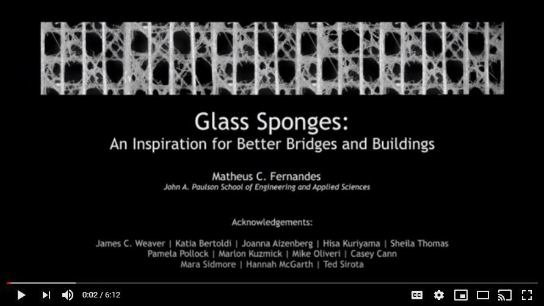

# Sponge Structure Data and Code
This contains the data and code for the publication in Nature Materials.

**doi: 10.1038/s41563-020-0798-1**

**Link to publication: [Mechanically robust lattices inspired by deep-sea
glass sponges](https://doi.org/10.1038/s41563-020-0798-1)**

Authors: Matheus C. Fernandes, Joanna Aizenbert, James C. Weaver, and Katia Bertoldi

Harvard University -- School of Engineering and Applied Sciences

For more information, please email me at fernandes@seas.harvard.edu

Corresponding Authors: jweaver@seas.harvard.edu; bertoldi@seas.harvard.edu

If you would like to further improve this code, please submit a pull request and clearly state your suggestions and the reason for this improvement. 

Additional codes required for reproduction of the information provided in supplemental information document of this publication are made available upon request.

Thank you!

